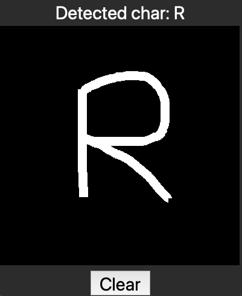

# Turbograd 
A Numpy-based auto-differentiation engine for building and training simple neural networks.

This project consists of three parts: 
- the implementation of turbograd
- the training and testing of a shallow neural net model (2-layer [MLP](https://en.wikipedia.org/wiki/Multilayer_perceptron)) on the [EMNIST](https://www.nist.gov/itl/products-and-services/emnist-dataset) letter and digit recognition dataset.
- the creation of a simple GUI for drawing and detecting a single character using the trained model.


  


## Usage
### Installation
The program was developed and tested using _Python 3.10_. The two needed dependencies are _Numpy_ for array operations and _Pillow_ for image manipulation.
Clone the repo with:
```sh
git clone git@github.com:Thom-P/turbograd.git turbograd
```
Optionally create and activate a virtual environment at the root of the project, and install the required packages (shown here for linux/macos):
```sh
cd turbograd
python -m venv .venv
source .venv/bin/activate
pip install -r requirements.txt
```

Download the EMNIST training and testing sets using the following bash script:
```sh
bash download_dataset.sh
```
Alternatively, you can manually download the EMNIST dataset [here](https://www.nist.gov/itl/products-and-services/emnist-dataset), choosing binary format as the original MNIST dataset. Extract the main gzip folder and then extract the four following archives:
> emnist-balanced-train-images-idx3-ubyte.gz
>
> emnist-balanced-test-images-idx3-ubyte.gz
>
> emnist-balanced-train-labels-idx1-ubyte.gz
>
> emnist-balanced-test-labels-idx1-ubyte.gz

Copy the four extracted files at the root of the _EMNIST_dataset_ folder of the project.

### Training the model
```sh
cd src
python -m train_model.py
```
The training over 50 epochs should take around a minute on a laptop and should achieve an accuracy of ~83%.

### Running the detector:
```sh
python -m char_detector.py
```
Note that the detector was trained on samples from american writers only. For the digits, this implies that the detector will fail to recognize some digits written in other country styles (see ...). For the letters, the non-cursive style was mainly used in the training set and is thus better recognized.   

## Turbograd: an auto-differentiation engine built from Numpy 
This part of the project was largely influenced by the [micrograd](https://github.com/karpathy/micrograd) engine and accompanying [tutorial video](https://www.youtube.com/watch?v=VMj-3S1tku0&ab_channel=AndrejKarpathy) by A. Karpathy. The main objective was to understand the auto-differentiation technique at the core of many deep learning framworks such as _Pytorch_ and _TensoFlow_. Another objective was to create a sufficiently efficient engine to use it on a "non-trivial" dataset. _micrograd_ is based on a scalar implementation of individual neurons and performs all matrix operations using explicit for loops in Python. While this implementation is very interesting for educational purposes, the engine runs dramatically slow for any practical application. The idea of _turbograd_ was thus to adapt the _micrograd_ approach to matrix formalism using _Numpy_ as the underlying library for fast linear algebra. The resulting engine can actually run at a decent speed, making it possible to train a shallow neural network model on the _EMNIST_ dataset in under a minute on a laptop cpu.

The key components of _turbograd_ are a Tensor and a Scalar class that wrap around Numpy 2D arrays and Numpy scalars. These objects allow to keep track of the successive matrix operations applied to the input data during the forward pass. These operations are organised into a computational graph. At the time of writing, the following four operations are suppported: matrix multiply, matrix add, element-wise [ReLU](https://en.wikipedia.org/wiki/Rectifier_(neural_networks)), and [Cross Entropy Loss](https://en.wikipedia.org/wiki/Cross-entropy). Note that these operations are the basic building blocks of a "modern" MLP for multi-class classification purposes. For each operation, a _backward_ method attached to the output object implements the gradient backpropagation to the input(s). 

A fully connected layer with linear transformation and optional ReLU activation can be instantiated with the _Dense_ class, and a stack of such layers is built using the Sequential class. The resulting model object can be called on an input matrix of size _n_features x n_training_examples_ (mini-batch processing) to provide output logits (with disabled ReLU activation on the last layer). The loss function is instantiated using the _CrossEntropyLoss_ class and called on the outputs logits and correspopnding training labels (class indices). This produces a loss Scalar object whose _backward_ method can be called after each forward pass. The computational graph is then traversed in reverse topological order to backpropagate the gradient throughout each Tensor object. The layer parameters Tensors (weights and biases) can then be updated using their populated gradients. The populated gradients are then reset to zero using the _model.zero_grad()_ method and the process can be repeated over a number of mini-batches and epochs until convergence. 

## Training and testing a MLP on the MNIST dataset

The Extended MNIST (EMNIST link) dataset [ref] was created as variant of the classical MNIST (ref) dataset. While MNIST contains only handwritten individual digits sample, the EMNIST counterparts contains upper case and lower case letter of the latin alphabet and presents a more challenging task for testing and bemchmarking classifiers and computer vision systems. Here, we focus our testing on the EMNIST balanced dataset, which contains 47 different character classes in equal number, for a total of 112'800 training examples and 18'800 testing examples. The 47 classes include the 10 0-9 digits, the 26 upper-case letters of the alphabet, and 11 lower-case letters. The missing 15 lower-case letter samples were merged with their upper-case counterparts due to their similarity in order to reduce the related classification error (letters C, I, J, K, L, M, O, P, S, U, V, W, X, Y and Z).

The 28x28 8-bit raw image data and associated labels are loaded from the binary files of the EMNIST_dataset folder. The only pre-processing applied is the normalization of the 0-255 integer pixel values to a 0-1 float32 range and the flattening of each image into a 784x1 column vector. We split the training data into 282 mini-batches of 400 examples.

We choose a 2-layer MLP architecture with 128 hidden units as one the simpler possible architecture to train a model. We detail the key components of the _train_model.py_ training script. Using the _turbograd_ module, the model is defined as:
```sh
model = Sequential([
    Dense(784, 128),
    Dense(128, 47, relu=False)
    ])
```
Note the 784 pixel input size, the 128 hidden output units of the hidden layer (with ReLU activation by default), and the output size 47 (number of classes) of the output layer with ReLU activation disabled. This model instantiation randomly initializes two sets of weigths and biases associated with the two layers.
 A single batch __X__ (784, 400) is then forward-passed through the model using `Z=model(X)`, and the loss of the output logits __Z__ (47, 400) is computed using `loss = CrossEntropyLoss()(Z, y)`, where y is a row vector of the 400 class indices corresponding to the 400 training examples of the batch. The loss is then backpropagated using the `loss.backward()` method, and the parameters of the models can be updated using:
 ```sh
 for p in model.parameters():
            p.array -= learning_rate * p.grad
 ```
The weights and biases are updated in a way that decreases the loss, i.e. opposite the gradient direction (downslope). The learning rate dictates the size of the update and should be empirically tuned as a tradeoff between stability of the gradient descent (not too large), and rapidity of convergence (not too slow). (NEED add grad descent somewhere).
After forward-passing all the batches (one epoch), the loss and accuracy can be computed on the unseen test set. The accuracy gives the percentage of correctly identified characters/images. The process is then repeated over a number of epochs until convergence. After 50 epochs, the model converges towards an accuracy of ~83% on the test set. While this number seems relatively low, note that some individual characters can be truly ambiguous (O vs 0, 9 vs g and q, 1 vs i and l, etc.). Even state of the art deep neural networks barely beat the 90% accuracy mark (ref). Note that the same 2-layer model trained over the original digits-only MNIST dataset converges towards 98% accuracy on the test set. 


## GUI for testing the digit recognizer on drawn digits

To test the trained model onto new handwritten characters, a simple GUI built using the _Tkinter_ builtin library was implemented. The lines drawn on a canvas are saved into a _PIL_ image and then preprocess according to the EMNIST procedure (ref). The preprocessing includes:
- downsampling to a 128x128 image (the original NIST format)
- applying a narrow gaussian filter to soften the edges
- cropping the digits using a square bounding box to maximize the digit size 
- adding a 2-pixel border around the cropped digit
- downsampling the image to 28x28 and normalizing pixel values in the 0-255 range (following MNIST original format)
The image is then fed to the trained model and the output logit of maximum value design the identified class (TO CHECK). 

put sample letter as in 
https://www.researchgate.net/figure/Samples-of-all-letters-and-digits-in-the-EMNIST-dataset_fig4_331902811

expalin non cursive better and american style numbers
youtube screenshot and video
https://www.youtube.com/watch?v=Hd_b8WiXTHM&ab_channel=Coopos

