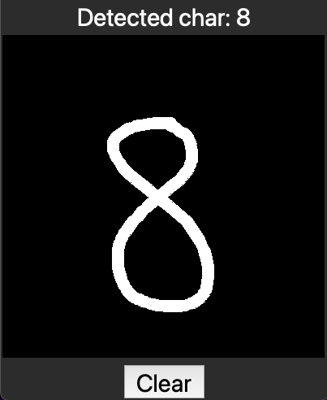
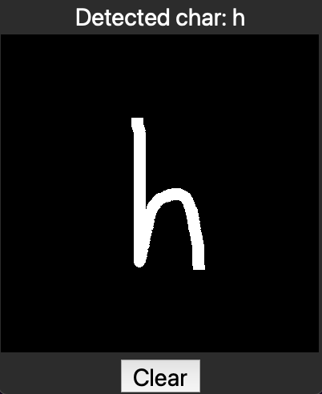

# Turbograd 
A Numpy-based auto-differentiation engine for building and training simple neural networks.

This project consists of three parts: 
- the implementation of turbograd
- the training and testing of a shallow neural net model (3-layer [MLP](https://en.wikipedia.org/wiki/Multilayer_perceptron)) on the [EMNIST](https://www.nist.gov/itl/products-and-services/emnist-dataset) letter and digit recognition dataset.
- the creation of a simple GUI for drawing and detecting a single character using the trained model.







## Usage
### Installation
The program was developed and tested using _Python 3.10_. The two needed dependencies are _Numpy_ for array operations and _Pillow_ for image manipulation.
Clone the repo with:
```sh
git clone git@github.com:Thom-P/turbograd.git turbograd
```
Optionally create and activate a virtual environment at the root of the project, and install the required packages (shown here for linux/macos):
```sh
cd turbograd
python -m venv .venv
source .venv/bin/activate
pip install -r requirements.txt
```

Download the EMNIST training and testing sets using the following bash script:
```sh
bash download_dataset.sh
```
Alternatively, you can manually download the EMNIST dataset [here](https://www.nist.gov/itl/products-and-services/emnist-dataset), choosing binary format as the original MNIST dataset. Extract the main gzip folder and then extract the four following archives:
> emnist-balanced-train-images-idx3-ubyte.gz
>
> emnist-balanced-test-images-idx3-ubyte.gz
>
> emnist-balanced-train-labels-idx1-ubyte.gz
>
> emnist-balanced-test-labels-idx1-ubyte.gz

Copy the four extracted files at the root of the _EMNIST_dataset_ folder of the project.

### Training the model
```sh
cd src
python -m train_model.py
```
The training over 50 epochs should take around a minute on a laptop and should achieve an accuracy of ~83%.

### Running the detector:
```sh
python -m char_detector.py
```
Note that the detector was trained on samples from american writers only. For the digits, this implies that the detector will fail to recognize some digits written in other country styles (see ...). For the letters, the non-cursive style was mainly used in training set and is thus better recognized.   

## Turbograd: an auto-differentiation engine built from Numpy 
This part of the project was largely influenced by the [micrograd](https://github.com/karpathy/micrograd) engine and accompanying [tutorial video](https://www.youtube.com/watch?v=VMj-3S1tku0&ab_channel=AndrejKarpathy) by A. Karpathy. The main objective was to understand the auto-differentiation technique at the core of many deep learning framworks such as Pytorch and TensoFlow. Another objective was to create a sufficiently efficient engine to use it on a "non-trivial" dataset. _micrograd_ is based on a scalar implementation of individual neurons and performs all matrix operations as explicit for loops in Python. While this implementation is very interesting for educational purposes, the engine runs dramatically slow for any practical application. The idea of _turbograd_ was thus to the adapt the _micrograd_ approach to matrix formalism using numpy as the underlying library for fast linear algebra. The resulting engine can actually run at a decent speed, making it possible to train a shallow neural network model on the EMNIST dataset in under a minute on a laptop cpu.

The key components of _turbograd_ are a Tensor and a Scalar class that wrap around Numpy 2D arrays and Numpy scalars. These objects allow to keep track of the successive matrix operations applied to the input data during the forward pass. These operations are organised into a computational graph. At the time of writing, the following four operations are suppported (matrix multiply, matrix add, element-wise [ReLU](https://en.wikipedia.org/wiki/Rectifier_(neural_networks)), and [Cross Entropy Loss](https://en.wikipedia.org/wiki/Cross-entropy). Note that these operations are the basic building blocks of a "modern" MLP for multi-class classification purposes. For each operation, a _backward_ attached to the output object implements the gradient backpropagation to the input(s). At the end of the forward pass (supporting mini-batch processing), the _backward_ method is called on the output loss Scalar object. The computational graph is then traversed in reverse topological order to backpropagate the gradient throughout each Tensor object. The parameters Tensors (weights and biases) can then be updated using their populated gradients.

## Training and testing a MLP on the MNIST dataset


## GUI for testing the digit recognizer on drawn digits

put sample letter as in 
https://www.researchgate.net/figure/Samples-of-all-letters-and-digits-in-the-EMNIST-dataset_fig4_331902811

expalin non cursive better and american style numbers
youtube screenshot and video
https://www.youtube.com/watch?v=Hd_b8WiXTHM&ab_channel=Coopos

